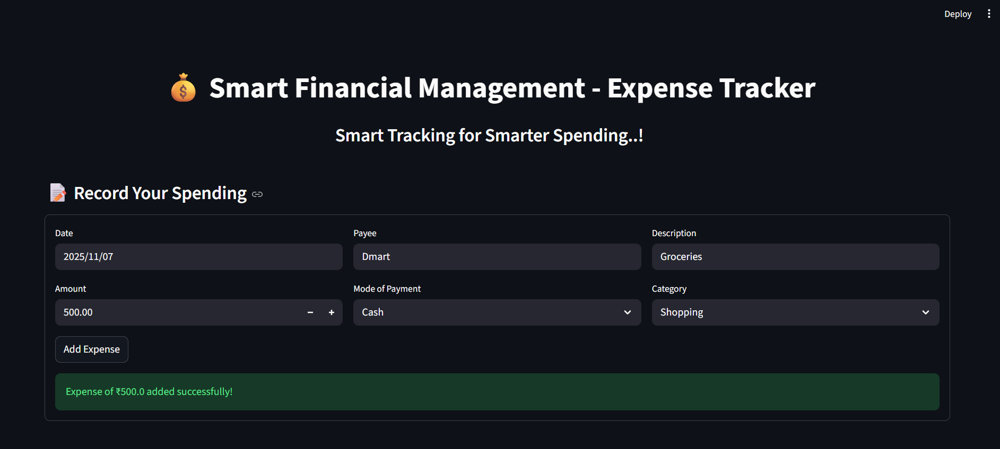

# 💰 Smart Financial Management - Expense Tracker

The **Smart Financial Management – Expense Tracker** is a web-based application designed to simplify personal finance tracking. It enables users to record, categorize, and analyze their daily expenses effectively.

Built with **Streamlit** and **SQLite**, the app provides a seamless interface for entering transactions, viewing spending summaries, and maintaining historical records. With **real-time updates**, data **validation**, and **persistent storage**, it ensures accuracy and efficiency in managing your financial data.

This project is ideal for individuals seeking a lightweight yet powerful solution to **monitor spending habits**, **control budgets**, and **make informed financial decisions**.

---

## 🌟 Project Highlights

- **Seamless Expense Tracking:** Record Date, Payee, Description, Amount, Category, and Mode of Payment.  
- **Recent Expenses at a Glance:** Clean tabular view of the latest entries.  
- **Insightful Summaries:** Quick-view boxes for total spending, category-wise spending, and payment modes.  
- **Smart Validation:** Prevents saving empty or incomplete entries.  
- **User-Friendly Interface:** Responsive design with intuitive layout and interactive controls.

---

## 🛠 Tech Stack

- **Programming Language:** Python
- **Framework:** Streamlit  
- **Database:** SQLite  
- **Data Handling & Analysis:** Pandas  

---

## 📂 Project Structure

```
SmartFinancialManagement/
|
├── Data/
│ └── ExpenseTracker_dataset.csv
│
├── app.py 
├── database.py
├── Eda.py
|
├── Modules/
│ ├── data_handler.py
│ └── analytics.py
|
├── README.md
├── requirements.txt
└── Outputs/
```
---

## 🖼 Screenshots

### 🧾 Add Expense Form


### 📊 Recent Expenses & 💵 Quick Overview


---

## 💡 How It Works & Why It Stands Out

The Smart Financial Management – Expense Tracker helps you record and analyze your daily spending in a simple, structured way. Here's how it functions and what makes it special:

- 🧾 **Add Expenses** – Enter the date, payee, description, amount, payment mode, and category using a clean, easy-to-use form.
- 📊 **View Recent Expenses** – Instantly see your most recent transactions in a clear tabular format.
- 💵 **Expense Summary** – Get real-time insights with summary boxes showing total expenses, category-wise spending, and preferred payment modes.
- 💾 **Persistent Storage** – All expenses are automatically saved in a SQLite database (ExpenseTracker.db) for long-term access.
- 🔍 **View Past Expenses** – Easily review all previously saved data whenever you want.
- ✅ **Smart Validation** – The app prevents incomplete or incorrect entries (e.g., empty payee or zero amount).
- 💡 **User-Friendly Design** – Simple, responsive interface built with Streamlit, making personal finance management effortless and interactive.

---

## 🔗 Connect with Me

**Kadulla Pravalika**
- GitHub: [Kadulla-Pravalika-28](https://github.com/Kadulla-Pravalika-28)  
- LinkedIn: [linkedin.com/in/kadulla-pravalika](https://www.linkedin.com/in/kadulla-pravalika/)  

---

## 📄 License

This project is licensed under the **MIT License** – See the [LICENSE](./LICENSE) file for details.